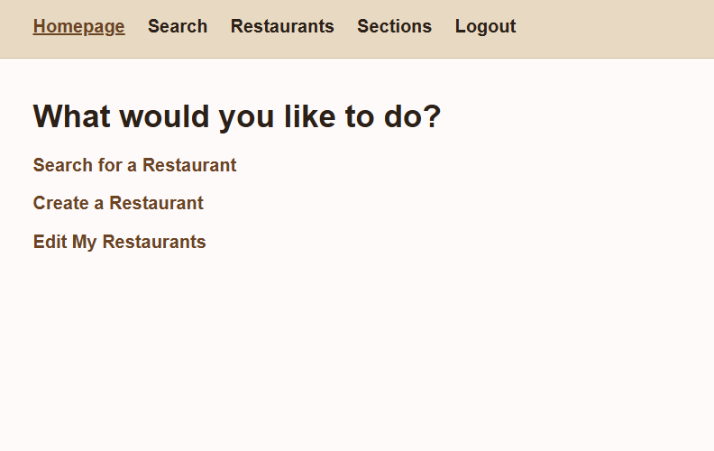
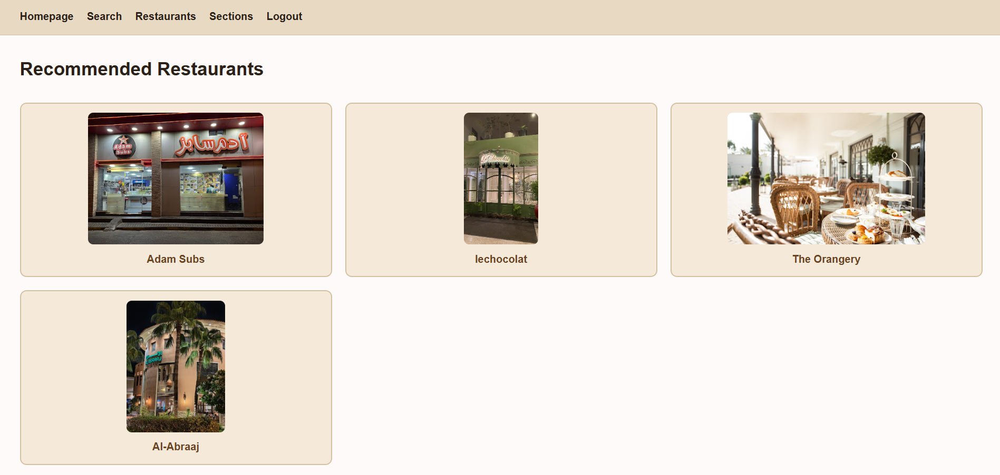

# Restaurant Recommendation

## Description

Restaurant Recommendation is a full-stack MEN (MongoDB, Express, Node) web app that helps you decide where to eat. Instead of scrolling through an endless list of restaurants, you answer a few quick questions — dine-in or take-away (and drive-through, if relevant), your budget, and the type of food you're in the mood for — and the app recommends restaurants that match.

Signed-in users can also add their own restaurants and sections (categories) to the shared list, and manage (edit/delete) only the ones they created.

Built as a solo project for the General Assembly Software Engineering Immersive program.

## Getting Started

- **Deployed app:** _[link coming soon — not deployed yet]_
- **Planning materials (Trello board):** https://trello.com/b/LMCvNF4O/project-2

## Attributions

Claude was used as a learning aid throughout development to explain concepts already covered in class, and to help polish the wording of this README.

- Restaurant photos sourced from Google Images.
- Restaurant location links point to Google Maps.
- Color contrast for accessibility was verified using the [WebAIM Contrast Checker](https://webaim.org/resources/contrastchecker/).

## Technologies Used

- Node.js
- Express
- MongoDB & Mongoose
- EJS
- bcrypt (password hashing)
- express-session & connect-mongo (session-based auth)
- method-override (PUT/DELETE via forms)
- morgan (request logging)
- dotenv
- HTML5, CSS3 (Flexbox & Grid)

## Next Steps

- Deploy the app and add the live link above.
- Wrap all route handlers in try/catch for proper error handling.
- Add a custom favicon.
- Add empty-state messaging ("No restaurants yet") to the remaining list pages.
- Use more semantic HTML containers (`<main>`, `<header>`, etc.) throughout.
- Full mobile-device testing pass beyond the current responsive CSS breakpoints.
- Support real image uploads (e.g. via Cloudinary) instead of pasted image URLs.
- Support multiple locations/branches per restaurant as structured data, rather than a single Google Maps link.
- Style checkboxes in the search flow to look like selectable buttons.

## Extra Feature
404 Erorr page
Location button
Delete confetmation massege 
At least 8 digits for password
Validation user's public creations by adding images to their restarants.